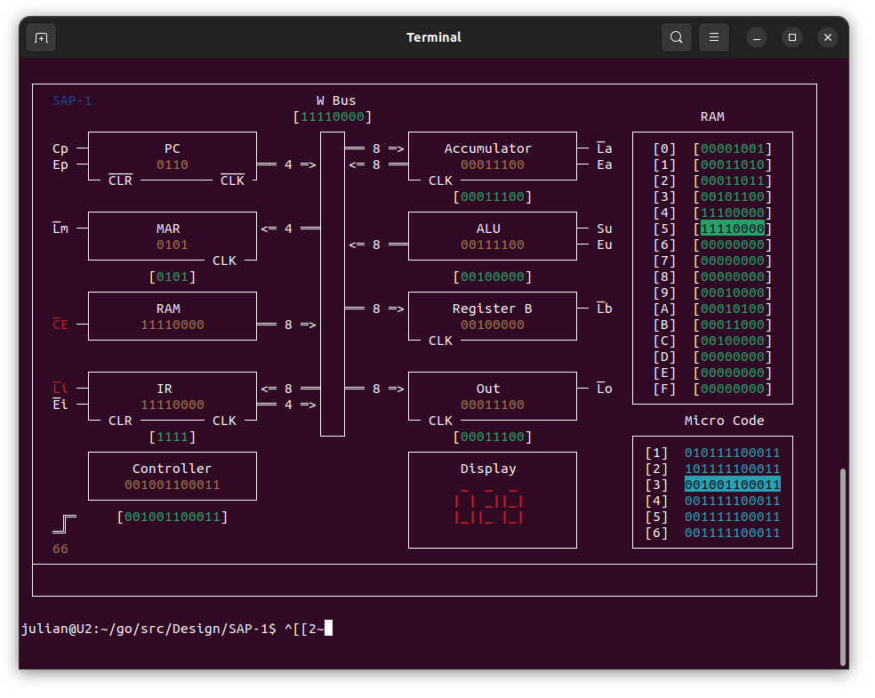

# SAP-1 Improvements

1. Plan a place for Debug messages
2. Add the Clock to the UI
    - Display Tick Num
    - Display Micro Step Num
    - Display Clock Phase
3. Display CLK, NCLK, CLR, NCLR
4. Display an Idle computer at start
5. Fix the delay in the RAM highlight
6. Enable Keyboard Control
    - Advance Step by Step
7. Enable Keyboard Configuration
    - Change the speed of the Clock
8. Highlight The Control Lines
    - Add to the Design full Control Lines
9. Enable going back a step (Fast Forward - Rerun)
10. Consider adding more statistics to the Screen
11. Control the background color of the Terminal
12. Extract parameters to a config file
13. Enable choosing programs
14. Validate and arrange all code
15. Plan a Screen builder
16. Add Decompiled Code Menomics
17. Add instructions 
    - JMP - Jump To Address
    - STA - Store (Write) Accumulator to Memory
    - JZ - Jump if Zero
    - JC - Jump if Carry
18. Plan a tester for individual Components
19. Understand the Read Write Dilemma
20. Change to use parralelism
21. Extract common logic to tools ( eg. Triggers )
22. Create a software architecture explanation
23. Enable replacing an object with an alternative complex object ( eg. Register electronics )
24. Pause on space hit
